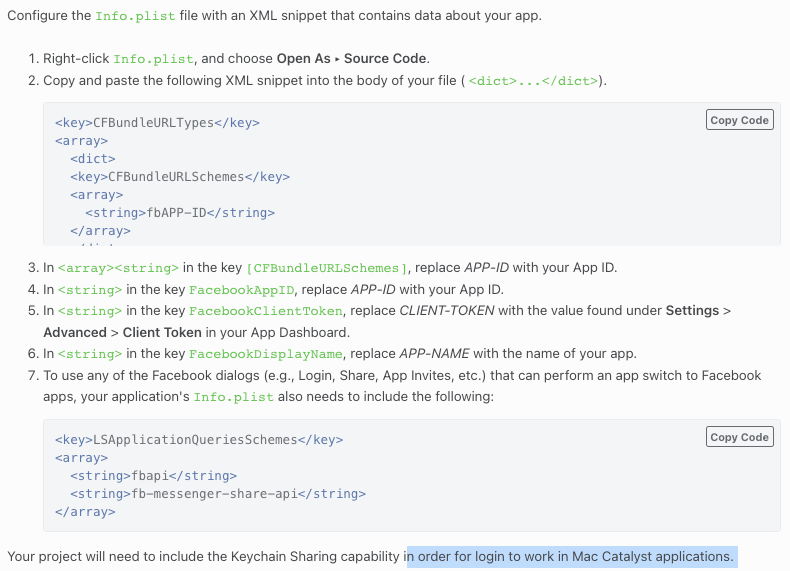

# State Management

Flutter is declarative. This means that when the state of the app changes, the user interface is redrawn to reflect the change.

- state is “whatever data you need in order to rebuild your UI at any moment in time”.
- You can have **Local/Ephemeral** and **Shared/App** state management.
- Local state refers to data that may affect the UI of a single widget. Local state management can be handled with a StatefulWidget. No need for state management packages. Restrict SatefulWidgets only to the elements that need to be redrawn for a specific change in order to minimize the load.
- Shared state is any data that needs to be shared across many widgets. For example, changing theme from Dark to Light.
- There are different packages for App state management but the most recommended is provider:

  `flutter pub add provider`

- To create a provider we create a class that extends `ChangeNotifier`.
- To use the Provider we have to declare it in a parent widget
  - `ChangeNotifierProvider()`

## Common errors

### Min firebase version for podfile

`Please specify a platform for this target in your Podfile`

To use firebase you need to update app/ios/Podfile from minimum supported ios 9 to 10:

`platform :ios, '10.0'`

https://stackoverflow.com/a/72117620/447738

### Java 11 is needed for Android 12 (Android emulator)

- Make sure you have installed the latest Android studio that comes with Java 11. Flutter by default uses the JDK that comes with Android studio for the emulator.

1. In Android studio check the 'about' from the menu and make sure it is running Java 11.
2. Run `flutter doctor -v` to confirm that flutter is using the Java 11 via Android Studio.
3. Confirm the same by running `./gradlew --version`
4. Run from your console
   `java --version` to confirm system version
   https://stackoverflow.com/a/67002271/447738
5. Update build.gradle contents to reference JavaVersion.VERSION_11 instead of JavaVersion.VERSION_1_8

### Social Auth

**Watch before**
([instructions](https://www.youtube.com/watch?v=Q00Foa8CiDk&ab_channel=CodeX))

- Avoid using bundle names in firebase with dashes (-). They are not acceptable for android and it becomes messy.
- The flutter google_sign_in plugin requires manual setup. You need to manually copy paste `google-services.json` to the `android\app` folder and `GoogleService-Info.plist` to the `app\ios folder.`
- For Android you must run `./gradlew signingReport` to generate a SHA fingerprint to paste into firebase console.

- For facebook check [this tutorial](https://www.youtube.com/watch?v=u8H652UY-L8&ab_channel=RivaanRanawat).
  Podfile should have `platform :ios, '11.0'`

- For facebook auth on ios follow all the steps shown in the image below. 
